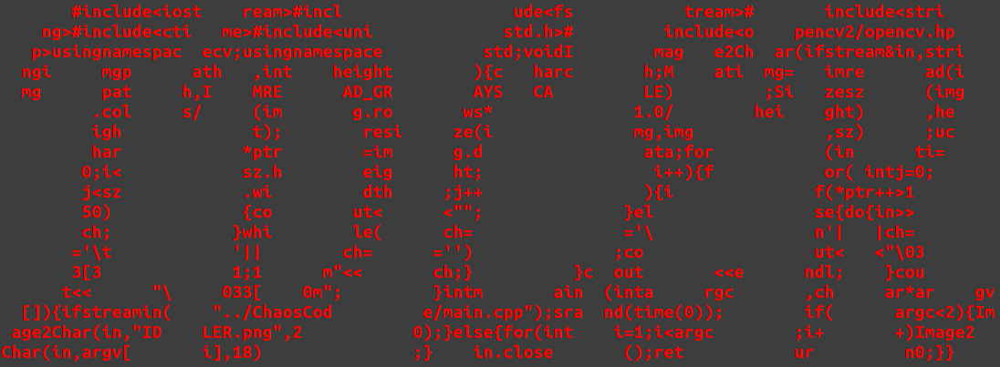

## BookSelector

### Introduction
`BookSelector` help people to select books in certain field, developed by `qtcreator`. `BookSelector` crawl the book information from `Douban` and show the booklist according to book rank.
### Developer


### Dependence
```
libhtmlcxx-dev
libboost-dev
pandoc
libopencv-dev
```

### Usage
```
[USAGE]
	[-b browser] #Browser you want to display result
	[-k keyword] #Field you intend to search
	[-t number] #TOP-K you wish to show
	[-p percent] #TOP k% you mean to show
	[-o filename] #File name you are desirous to output
	[-a] #Display all book in this field
	[-r] #No matter cache exist or not, re-download pages
	[-N] #Don't output markdown file
	[-D] #Don't display html with browser

```
### Default Configuration
```
[CONFIG]
	Browser: firefox
	Keyword: C++
	Output File: Booklist.html
	Top-K: ALL
	Percent: 100% 
	Reload: NO
	Display: YES
	Save Markdown: YES

```
### Demo


